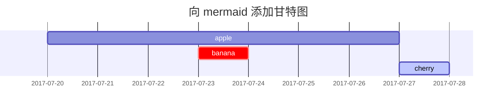

这篇文章是为了展示 [**Chirpy**](https://github.com/cotes2020/jekyll-theme-chirpy/) 上的 Markdown 语法和对应的渲染效果，方便写作时作为参考。

Markdown 基本语法可参考 [Markdown 官方教程](https://markdown.com.cn/cheat-sheet.html) 。

## 标题
---

### 普通标题

```markdown
# H1 标题
## H2 标题
### H3 标题
#### H4 标题
```

### 使用 html 标签

```markdown
<h2>H2 标题</h2>
```

### 不出现在右侧目录栏中

```markdown
<h3 data-toc-skip>H3 标题</h3>
```

### 自定义标题编号 {#custom-id}

例如上面这个标题。

```markdown
### 自定义标题编号 {#custom-id}
```
---

## 分割线
```markdown
---
```
---

## 段落

房祖名涉毒被捕后，身为禁毒宣传大使的成龙大哥到了拘留所，看到自己儿子二话不说上去就是一顿暴打。大哥的功夫真了得，几个警察愣是没拦住，打了十分钟，最后一脚踹到角落里。好家伙，足足踹飞 5 米远，这时一个角落里传来一声：“爸，你打张默干嘛？”。 <br>
张国立听说了以后十分恼火，这能行？跑到拘留所揪住房祖名结结实实一顿胖揍，这时一个角落传来一声：“叔，你再打张默就死了……”

Quisque egestas convallis ipsum, ut sollicitudin risus tincidunt a. Maecenas interdum malesuada egestas. Duis consectetur porta risus, sit amet vulputate urna facilisis ac. Phasellus semper dui non purus ultrices sodales. Aliquam ante lorem, ornare a feugiat ac, finibus nec mauris. Vivamus ut tristique nisi. Sed vel leo vulputate, efficitur risus non, posuere mi. Nullam tincidunt bibendum rutrum. Proin commodo ornare sapien. Vivamus interdum diam sed sapien blandit, sit amet aliquam risus mattis. Nullam arcu turpis, mollis quis laoreet at, placerat id nibh. Suspendisse venenatis eros eros.

## 文本样式

`**这是粗体文本**` **这是粗体文本** <br>
`__This is bold text__` __This is bold text__ <br>
`*这是斜体文本*` *这是斜体文本* <br>
`_This is italic text_` _This is italic text_ <br>
`~~Strikethrough 删除线~~` ~~Strikethrough 删除线~~ <br>
使用 `<kbd> </kbd>` 显示按键 <kbd>Ctrl</kbd> + <kbd>⇧ Shift</kbd> + <kbd>↵ Enter</kbd> <br>
使用 `<b>` 可以实现 <b>加粗</b> 的效果 <br>
使用 `<i>` 可以实现 <i>斜体</i> 的效果 <br>
使用 `<em>` 表示 <em>强调</em> 的效果 <br>
使用 `<br>` 可以在同一段落内换行 <br>
使用 `<sup>` 做上标如 O<sup>2-</sup> <br>
使用 `<sub>` 做下标如 H<sub>2</sub>O

## 列表
---
### 有序列表

```markdown
1. 第一个
2. 第二个
3. 第三个
```

1. 第一个
2. 第二个
3. 第三个

### 无序列表

```markdown
- 章
  + 小节
    * 段落
```

- 章
  + 小节
    * 段落

### 待办列表

```markdown
- [ ] 工作项
  + [x] 步骤 1
  + [x] 步骤 2
  + [ ] 步骤 3
```

- [ ] 工作项
  + [x] 步骤 1
  + [x] 步骤 2
  + [ ] 步骤 3

### 描述列表

```markdown
太阳
: 地球环绕的恒星

月亮
: 地球的天然卫星，通过太阳反射光可见
```

太阳
: 地球环绕的恒星

月亮
: 地球的天然卫星，通过太阳反射光可见

---

## 引用块

```markdown
> 此行显示 _引用块_ 。
> > 嵌套一层
> > > 嵌套两层
```

> 此行显示 _引用块_ 。
> > 嵌套一层
> > > 嵌套两层

## 提示

```markdown
> 显示 `tip` 类型提示的例子。
{: .prompt-tip }

> 显示 `info` 类型提示的例子。
{: .prompt-info }

> 显示 `warning` 类型提示的例子。
{: .prompt-warning }

> 显示 `danger` 类型提示的例子。
{: .prompt-danger }
```

> 显示 `tip` 类型提示的例子。
{: .prompt-tip }

> 显示 `info` 类型提示的例子。
{: .prompt-info }

> 显示 `warning` 类型提示的例子。
{: .prompt-warning }

> 显示 `danger` 类型提示的例子。
{: .prompt-danger }

## 表格

```markdown
| 公司                         | 联系人            | 国家     |
|:-----------------------------|:-----------------|--------:|
| 阿尔弗雷德                    | 玛丽亚·安德斯      | 德国    |
| 岛屿贸易                      | 海伦·贝内特        | 英国    |
| 意大利食品杂志                 | 乔瓦尼·罗韦利      | 意大利  |
```

| 公司                         | 联系人            | 国家     |
|:-----------------------------|:-----------------|--------:|
| 阿尔弗雷德                    | 玛丽亚·安德斯      | 德国    |
| 岛屿贸易                      | 海伦·贝内特        | 英国    |
| 意大利食品杂志                 | 乔瓦尼·罗韦利      | 意大利  |

## 链接

```markdown
<http://127.0.0.1:4000>

[Chirpy](https://github.com/cotes2020/jekyll-theme-chirpy/)

[新窗口打开](./){: target="_blank"}
```

<http://127.0.0.1:4000>{: target="_self"}

[Chirpy](https://github.com/cotes2020/jekyll-theme-chirpy/){: target="_self"}

[新窗口打开](./){: target="_blank"}

## 脚注

```markdown
点击角标将会定位到脚注[^footnote]，这是另一个脚注[^fn-nth-2]。
```

点击角标将会定位到脚注[^footnote]，这是另一个脚注[^fn-nth-2]。

## 内联代码

```markdown
这是 `Inline Code` 的示例。
```

这是 `Inline Code` 的示例。

## 文件路径

```markdown
就像这样 `/path/to/the/file.extend`{: .filepath} 。
```

就像这样 `/path/to/the/file.extend`{: .filepath} 。

## 代码块
---
### 常规

````markdown
```
This is a common code snippet, without syntax highlight and line number.
```
````

```
This is a common code snippet, without syntax highlight and line number.
```

### 指定语言

````markdown
```bash
if [ $? -ne 0 ]; then
  echo "The command was not successful.";
  #do the needful / exit
fi;
```
````

```bash
if [ $? -ne 0 ]; then
  echo "The command was not successful.";
  #do the needful / exit
fi;
```

### 指定文件名

````markdown
```sass
@import
  "colors/light-typography",
  "colors/dark-typography"
```
{: file='_sass/jekyll-theme-chirpy.scss'}
````

```sass
@import
  "colors/light-typography",
  "colors/dark-typography"
```
{: file='_sass/jekyll-theme-chirpy.scss'}

---

## 数学

```markdown
$$ \sum_{n=1}^\infty 1/n^2 = \frac{\pi^2}{6} $$

当 $a \ne 0$ 时， $ax^2 + bx + c = 0$ 有两个解，它们是

$$ x = {-b \pm \sqrt{b^2-4ac} \over 2a} $$
```

$$ \sum_{n=1}^\infty 1/n^2 = \frac{\pi^2}{6} $$

当 $a \ne 0$ 时， $ax^2 + bx + c = 0$ 有两个解，它们是

$$ x = {-b \pm \sqrt{b^2-4ac} \over 2a} $$

## Mermaid SVG

````markdown

````


## 图片
---
### 默认（带标题）

```markdown
{: width="972" height="589" }
_全屏宽度且居中对齐_
```

{: width="972" height="589" }
_全屏宽度且居中对齐_

### 左对齐

```markdown
{: width="972" height="589" .w-75 .normal}
```

{: width="972" height="589" .w-75 .normal}

### 向左浮动

```markdown
{: width="972" height="589" .w-50 .left}
```

{: width="972" height="589" .w-50 .left}
Praesent maximus aliquam sapien. Sed vel neque in dolor pulvinar auctor. Maecenas pharetra, sem sit amet interdum posuere, tellus lacus eleifend magna, ac lobortis felis ipsum id sapien. Proin ornare rutrum metus, ac convallis diam volutpat sit amet. Phasellus volutpat, elit sit amet tincidunt mollis, felis mi scelerisque mauris, ut facilisis leo magna accumsan sapien. In rutrum vehicula nisl eget tempor. Nullam maximus ullamcorper libero non maximus. Integer ultricies velit id convallis varius. Praesent eu nisl eu urna finibus ultrices id nec ex. Mauris ac mattis quam. Fusce aliquam est nec sapien bibendum, vitae malesuada ligula condimentum.

### 向右浮动

```markdown
{: width="972" height="589" .w-50 .right}
```

{: width="972" height="589" .w-50 .right}
Praesent maximus aliquam sapien. Sed vel neque in dolor pulvinar auctor. Maecenas pharetra, sem sit amet interdum posuere, tellus lacus eleifend magna, ac lobortis felis ipsum id sapien. Proin ornare rutrum metus, ac convallis diam volutpat sit amet. Phasellus volutpat, elit sit amet tincidunt mollis, felis mi scelerisque mauris, ut facilisis leo magna accumsan sapien. In rutrum vehicula nisl eget tempor. Nullam maximus ullamcorper libero non maximus. Integer ultricies velit id convallis varius. Praesent eu nisl eu urna finibus ultrices id nec ex. Mauris ac mattis quam. Fusce aliquam est nec sapien bibendum, vitae malesuada ligula condimentum.

### 深色/浅色模式和阴影

```markdown
下图将根据主题偏好切换深色/浅色模式，请注意它有阴影。

{: .light .w-75 .shadow .rounded-10 w='1212' h='668' }
{: .dark .w-75 .shadow .rounded-10 w='1212' h='668' }
```

下图将根据主题偏好切换深色/浅色模式，请注意它有阴影。

{: .light .w-75 .shadow .rounded-10 w='1212' h='668' }
{: .dark .w-75 .shadow .rounded-10 w='1212' h='668' }

---

## 视频


```markdown

```




## 反向脚注

```markdown
[^footnote]: 脚注源
[^fn-nth-2]: 第二个脚注源
```

[^footnote]: 脚注源
[^fn-nth-2]: 第二个脚注源
